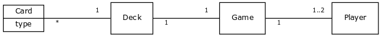

# Architecture

`Game` is the main object holding `Deck` and `Player`(s). `Card`s are generated when populating the `Deck` and the principal game logic is implemented by comparing `Card.type` to another as the players try to match them up.