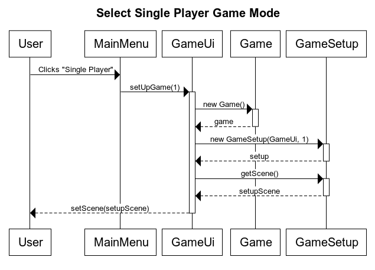

# Software Architecture

## General Structure

Shamery consists of three main packages:

- `fi.basse.shamery.domain`: Game logic and object modeling.
- `fi.basse.shamery.scoring`: Scoring logic, i.e., classes implementing the `Scoring` interface.
- `fi.basse.shamery.ui`: JavaFX GUI for playing the game.

## Game Logic


`Game` is the main object holding `Deck` and `Player`(s). `Card`s are generated when populating the `Deck` and the principal game logic is implemented by comparing `Card.type` to another as the players try to match them up.

### `Game.java`

Holds all data related to a round of game either directly or by reference. Especially, it holds references to the `Deck` and `Scoring`, and a list of `Player`s. This class also implements the game logic and offers the `reveal(Card)` method which is used to try and reveal chosen cards and thus play the game.

### `Deck.java`

`Deck` holds all the cards in the game and offers methods to interact with them. It is also responsible for generating the cards upon initialization and uses `CardPairs` to load card configuration for this.

### `Scoring.java`

This is an interface to allow for different types of scoring. The main signatures are `startTurn()`, `continueTurn()` and `endTurn()`, to be called respectively when a single card is revealed, when a matching pair is revealed and when a non-matching pair is revealed. Scoring classes update players' scores via a `Game` object.

## Example of Game Logic

### Select Single Player Game Mode



Starting the application present the user with the buttons to select either single player or multiplayer game mode. Clicking the single player button calls the `setUpGame(int)` function with the parameter `1` as the number of players. The method first constructs a `Game` object and then proceeds to create a `GameSetup` object with the given number of players. Then `getScene()` is called on the setup object and the received `Scene` is shown by calling `GameUi.setScene()`. Thus the user is transitioned to the next step of game creation, which is entering the player name and selecting the scoring mode.

## Data Persistence

### Static Data

Cards in play are configured in `src/main/resources/cardpairs.json` using JSON format. The file should be an array of objects with the following properties:

- `type` - Unique type code (integer) for this card pair.
- `name` - Icon name, used in loading the pictures to represent these cards on the board. *(Not yet implemented.)*

Example:

```json
[
  {
    "type": 1,
    "name": "pair1"
  },
  {
    "type": 2,
    "name": "pair2"
  }
]
```
