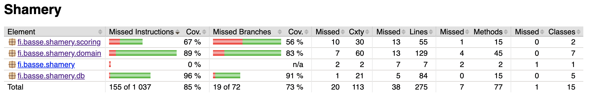

# Testing Documentation

This application has been tested manually through the GUI and automatically with JUnit and Mockito.

## Unit and Integration Testing

Automated tests are concentrated on the `db` and `domain` packages to verify main functionality. The `scoring` package also has some tests but has been mainly tested manually.

Most of the test classes comprise both integration and unit tests.

Test row coverage is 85 % and branch coverage 73 %.

## System Testing

The application was manually tested thoroughly before `v1.0` publication. Testing was done on macOS 10.15 and Ubuntu 18.04.
