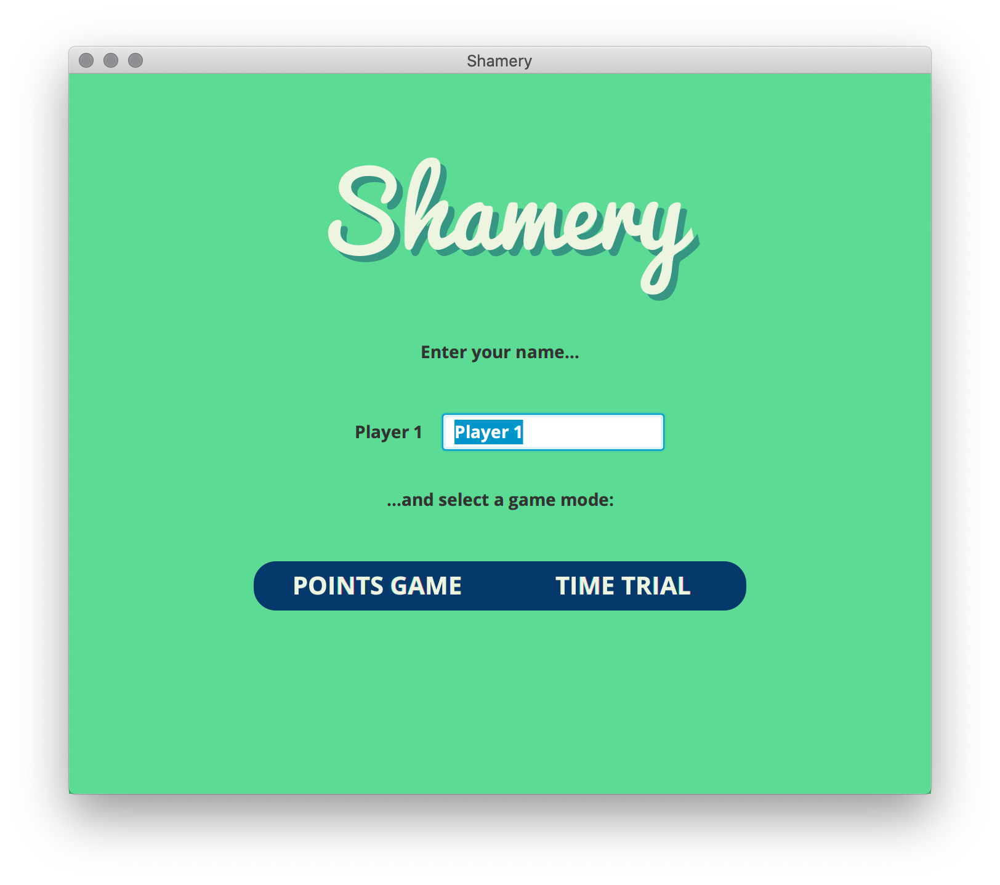

# User Guide

## Get The App

Download the latest `.jar` file from the [releases page](https://github.com/joonashak/ot-harjoitustyo/releases).

## Launching

In your console, go to the directory containing the downloaded `.jar` file and run:

```bash
java -jar Shamery-1.0-SNAPSHOT.jar
```

Depending on your system configuration you should also be able to launch by double clicking the `.jar`.

## Starting a New Game

Upon launching the application, you should be greeted with the following view:


This is the main menu where you should choose between a single player and a multiplayer game.

### Single Player



If you select a single player game, the view above will be presented, prompting you to enter your nickname and to choose between the two scoring options, points and timing. Clicking either of these buttons will immediately start a corresponding game.
